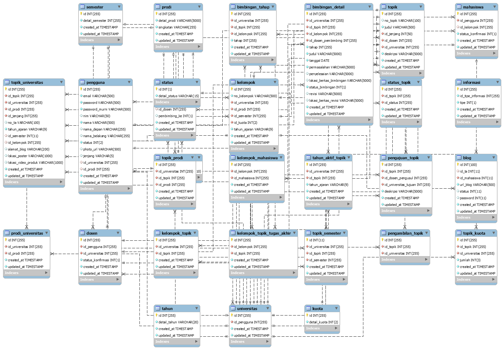

Tugas Akhir Dalam Jaringan (TADJ)
==============================================

Situs TADJ: http://tadj.lskk.ee.itb.ac.id/

Source Code TADJ di GitHub Repository:

1. Server TADJ (PHP): https://github.com/lskk/tadj
2. TADJ for Android: https://github.com/lskk/tadj-android

   Poster Tugas Akhir Dalam Jaringan (T01036)

Relational Database Design Diagram
----------------------------------

   MySQL Relational Database Design Diagram for TADJ
